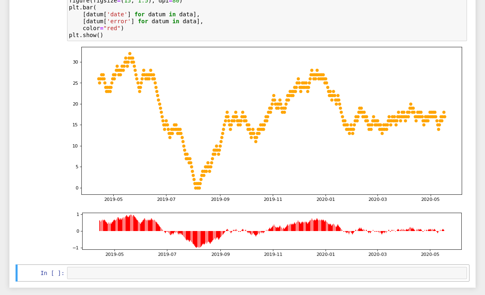
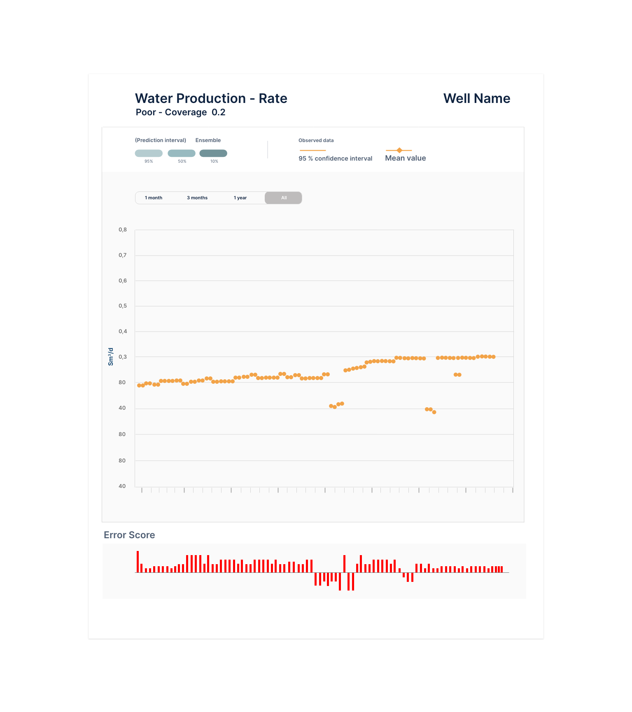

# Frontend Developer - Assessment

Our research team wants us to add a new component to one of our apps to display Water Production data. They provided us with a `data.json` file which contains a list of objects for different dates. The object type is described below:

```typescript
type WaterRate = {
    date: string;
    value: number;
    error: number;
}
```

They also provided a jupyter notebook file that displays the contents of the `data.json` file:



> NOTE: This notebook file was only provided for us to check the data we have in the `data.json` file and we should not write any Python code in this task.

To help with this process, our UX design team created the following wireframe that describes the component's appearance:



Your task is create a component using ReactJS that follows the wireframe above.

## Server-side api

This project provides a server-side nodejs API that contains the endpoint to retrieve the data. 

To start the service API, you need to run:

    yarn start

and use the url: `http://localhost:8080/data` to access the data.

## Notes

- If something is not clear and you want to make assumptions in order to proceed you can document it in a separated file called ASSUMPTIONS.md
- You are free to use any javascript chart library you want, just make sure the library works fine with ReactJS :)
- The server API is built on top of the https://github.com/typicode/json-server library
- You can send your final solution as a zip file or provide it in as a public github repository
- Please let us know how much time you spent to solve the task


Good luck!
